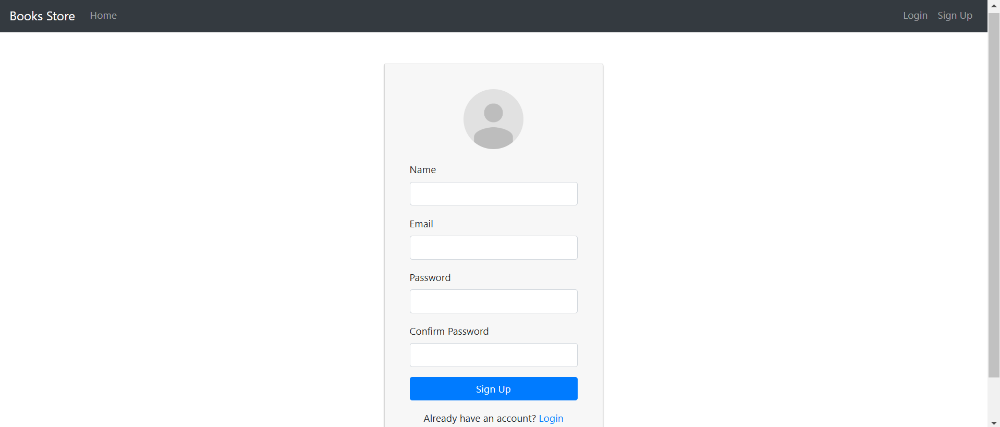
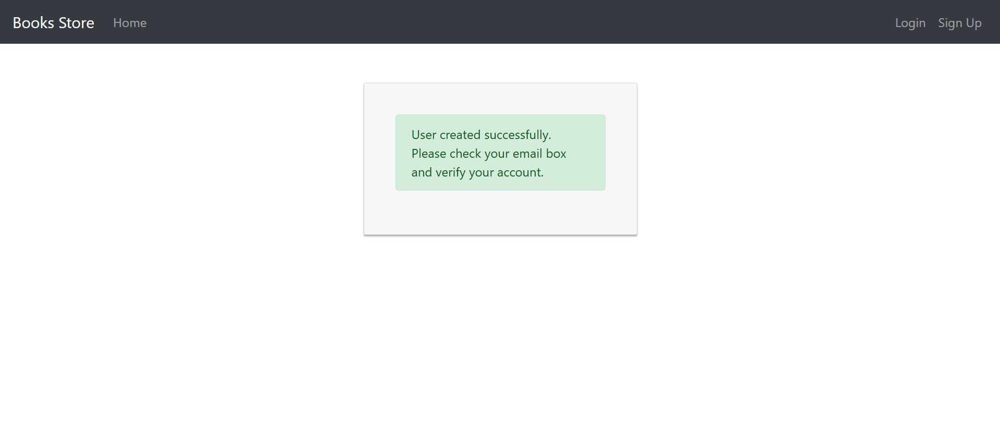
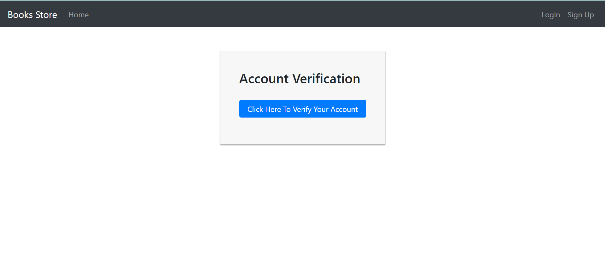
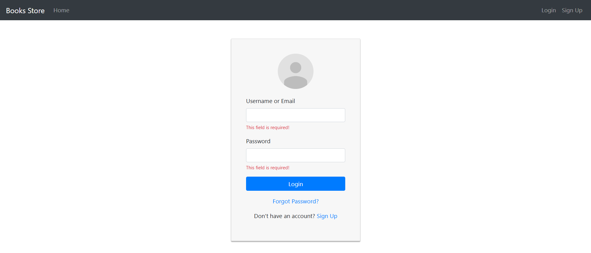
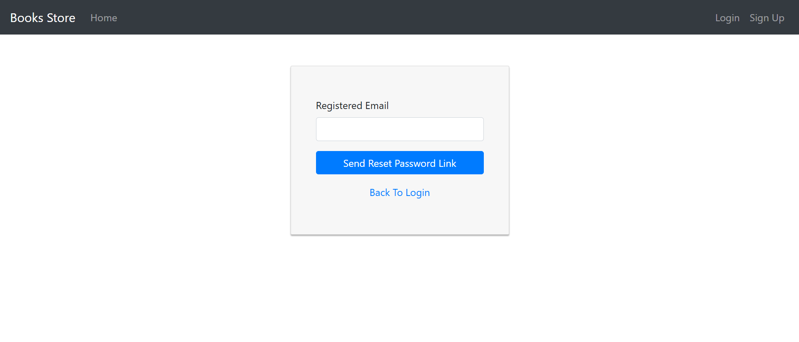
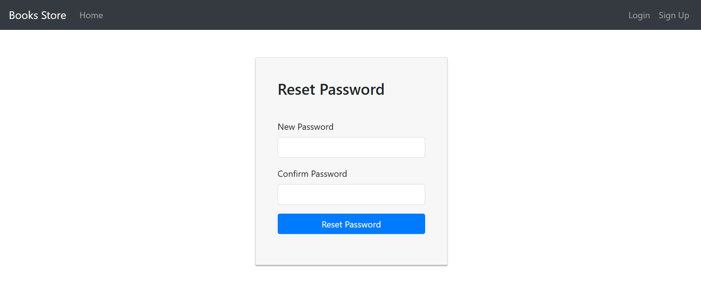
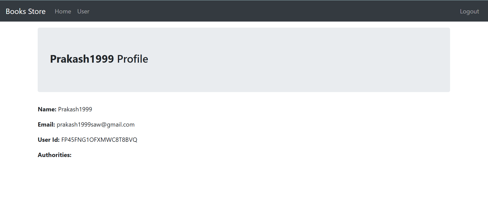
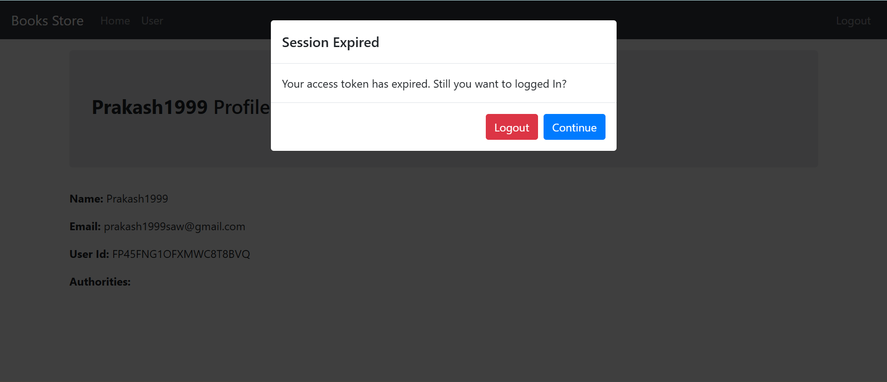

# **Books Store** 📚  
A FastAPI CRUD app where users can create an account and manage their favorite books.  

## 📌 GitHub Repository  
```bash
https://github.com/Prakashsaw/FastAPI-CRUD-App
```

## 🌍 Live Demo  
```bash
https://fastapi-crud-app.netlify.app
```

---

## **📚 Description**  
Books Store is a **full-stack CRUD application** built with FastAPI, React.js, and MongoDB. Users can register, log in, and manage their favorite books securely. The app features **JWT-based authentication, email verification, session management, and password recovery**.  

---

## **🛠 Tech Stack**  

### **Frontend**  
- JavaScript, React.js, Bootstrap, CSS  

### **Backend**  
- Python, FastAPI, FastAPI-Mail  

### **Database**  
- MongoDB  

---

## **🚀 Getting Started**  

### **Step 1: Clone the Repository**  
```bash
git clone https://github.com/Prakashsaw/FastAPI-CRUD-App.git
```

### **Step 2: Navigate to the Project Directory**  
```bash
cd FastAPI-CRUD-App
```

### **Step 3: Install Dependencies for Frontend & Backend**  

#### **Frontend Setup**  
```bash
cd frontend
npm install
```

#### **Backend Setup**  
1️⃣ Create a virtual environment:  
```bash
python -m venv your_virtual_env_name
```
2️⃣ Activate the virtual environment:  
```bash
# Windows
your_virtual_env_name\Scripts\activate

# macOS/Linux
source your_virtual_env_name/bin/activate
```
3️⃣ Install dependencies:  
```bash
pip install -r requirements.txt
```

---

### **Step 4: Configure Environment Variables**  
Create a `.env` file in the `backend` directory and add the following environment variables:  

```bash
MONGO_URI = 
DB_NAME = 

JWT_SECRET_KEY = 
JWT_ALGORITHM = 
JWT_ACCESS_SECRET_KEY = 
JWT_ACCESS_EXPIRY_MINUTES = 
JWT_REFRESH_SECRET_KEY = 
JWT_REFRESH_EXPIRY_DAYS = 

USER_SESSION_EXPIRY_MINUTES = 

MAIL_USERNAME = 
MAIL_PASSWORD = 
MAIL_FROM = 
MAIL_FROM_NAME = 
MAIL_PORT = 
MAIL_SERVER = 
MAIL_STARTTLS = 
MAIL_SSL_TLS = 
USE_CREDENTIALS = 
VALIDATE_CERTS = 

FRONTEND_HOST = http://localhost:3000 or https://your-deployed-domain.com
APP_NAME = 
```

---

### **Step 5: Run the Application**  

#### **Start the Backend Server**  
- **If the virtual environment is not activated, activate it first:**
```bash
# Windows
your_virtual_env_name\Scripts\activate

# macOS/Linux
source your_virtual_env_name/bin/activate
```
- **Run the FastAPI server:**
```bash
uvicorn main:app --reload
```

#### **Start the Frontend React App**  
```bash
cd frontend
npm run start
```

📌 **Now, the Books Store app should be running locally!**

---

## **✨ Features**  

- **User Registration & Login** with complete validation.  
- **Email Verification:** Users receive a confirmation link via email to verify their account.  
- **Secure Authentication & Authorization:**  
  - Middleware ensures protected routes using JWT tokens.  
  - Refresh tokens allow users to renew access tokens without re-logging in.  
- **Forgot Password:** Users can reset their password if forgotten.  
- **Session Expiry Handling:**  
  - If an access token expires, users can refresh it without logging in again.  
- **CRUD Operations:**  
  - Users can add, edit, delete, and manage their favorite books.  
- **User Profile Management:**  
  - Users can update their profile details and change their password.  

---

## **📸 Screenshots**  

| Feature | Screenshot |
|---------|-----------|
| **User Sign Up** |  |
| **Email Verification Link Sent** |  |
| **Email Verification Confirmation** |  |
| **User Login** |  |
| **Forgot Password** |  |
| **Reset Password Link Sent** |  |
| **Reset Password** |  |
| **User Dashboard** |  |
| **Session Expiry & Token Refresh** |  |

---

## **👨‍💻 Made By**  
- [@Prakashsaw](https://github.com/Prakashsaw)  

---

## **🐜 License**  
This project is licensed under the **MIT License**.  

---

### **🌟 If you like this project, don't forget to star the repo!** ⭐  


<!-- # **Books Store**: A FastAPI CRUD app where user can create account and keep/add their favourite books.

## GitHub Repo Link: 
```bash 
  https://github.com/Prakashsaw/FastAPI-CRUD-App
```
## Live Demo URL: 
```bash 
  https://fastapi-crud-app.netlify.app
```

## Description
* Description will be added by GPT

## Tech Stack

**Frontend:** Javascript, React.js, Bootstrap, CSS. 
**Backend:** Python, FastAPI, fastapi-mail
**Database:** MongoDB.

## Run Locally

**Step:1-** Clone the project

```bash
  git clone https://github.com/Prakashsaw/FastAPI-CRUD-App.git
```

**Step:2-** Go to the project directory

```bash
  cd FastAPI-CRUD-App
```

**Step:3-** Install all the dependencies in frontend and backend folders one by one.

* Installl dependencies for frontend
```bash
  cd frontend/
  npm install
```
* Installl dependencies for backend
1. Make virtual environment
```bash
    python -m venv your_virtual_env_name
```
2. Activate the virtual environment
```bash
    your_virtual_env_name\Scripts\activate
```
3. Install all the package dependencies from requirements.txt
```bash
    pip install -r requirements.txt
```

**Step:4-** Make .env file in your root of backend folder which will contain all your development environment variables with private keys
```bash
    MONGO_URI = 
    DB_NAME = 

    JWT_SECRET_KEY = 
    JWT_ALGORITHM = 
    JWT_ACCESS_SECRET_KEY = 
    JWT_ACCESS_EXPIRY_MINUTES = 
    JWT_REFRESH_SECRET_KEY = 
    JWT_REFRESH_EXPIRY_DAYS = 

    USER_SESSION_EXPIRY_MINUTES = 

    MAIL_USERNAME = 
    MAIL_PASSWORD = 
    MAIL_FROM = 
    MAIL_FROM_NAME = 
    MAIL_PORT = 
    MAIL_SERVER = 
    MAIL_STARTTLS = 
    MAIL_SSL_TLS = 
    USE_CREDENTIALS = 
    VALIDATE_CERTS =

    FRONTEND_HOST = http://localhost:3000 or https://your-deployed-domain.com
    APP_NAME = 
```

**Step:5-** Start backend and frontend in seperate two terminals

* Start the backend
- First activate the virtual_environmant if not activated
```bash
    //open new terminal
    cd backend
    your_virtual_env_name\Scripts\activate
```
- Start the server
```bash
  uvicorn main:app --reload
```

* Start the frontend react app
```bash
  //open new terminal
  cd frontend
  npm run start
```

**Step:6-** Now Books store app is running in your local host

## Features 🚀  

- **User Registration & Login** with complete validation.  
- **Email Verification:** Users receive a confirmation link via email to verify their email address.  
- **Secure Authentication & Authorization** Created a middleware for user authorization for each protected routes using JWT tokens. Create refresh token as well for user renew access tokens if expired.
- **Forgot Password:** Users can reset their password if they forget it.  
- **Refresh expired access token:** If user session expired (access token expired) then user can renew their access token and can continue their session without logout and login again till their next session.

## Screenshots 📸


## Made By
- [@Prakashsaw](https://github.com/Prakashsaw)
 -->


<!-- ## React Login and Registration example with JWT and HttpOnly cookie

Build React JWT Authentication and Authorization example using React Hooks, React Router, Axios and Bootstrap (without Redux):
- JWT Authentication Flow for User Signup & User Login
- Project Structure for React Authentication (without Redux) with React Router & Axios
- Creating React Components with Form Validation using Formik and Yup
- React Pages for accessing protected Resources (Authorization)
- Dynamic Navigation Bar in React App

For more detail, please visit:
> [React Login and Registration example with JWT](https://bezkoder.com/react-login-example-jwt-hooks/)

> [React + Redux: Login and Registration example with JWT](https://www.bezkoder.com/redux-toolkit-auth/)

Working with back-end servers:
> [Spring Boot + H2](https://www.bezkoder.com/spring-boot-security-jwt/)

> [Spring Boot + MySQL/PostgreSQL](https://www.bezkoder.com/spring-boot-login-example-mysql/)

> [Spring Boot + MongoDB](https://www.bezkoder.com/spring-boot-mongodb-login-example/)

> [Node Express + MySQL/PostgreSQL](https://www.bezkoder.com/node-js-express-login-example/)

> [Node Express + MongoDB](https://www.bezkoder.com/node-js-express-login-mongodb/)

Fullstack (JWT Authentication & Authorization example):
> [React + Spring Boot](https://bezkoder.com/spring-boot-react-jwt-auth/)

> [React + Node.js Express](https://bezkoder.com/react-express-authentication-jwt/)

This project was bootstrapped with [Create React App](https://github.com/facebook/create-react-app).

### Project setup

In the project directory, you can run:

```
npm install
# or
yarn install
```
yarn
or

### Compiles and hot-reloads for development

```
npm start
# or
yarn start
```

Open [http://localhost:8081](http://localhost:8081) to view it in the browser.

The page will reload if you make edits.

### Related Posts
> [In-depth Introduction to JWT-JSON Web Token](https://bezkoder.com/jwt-json-web-token/)

> [React CRUD example using Hooks](https://bezkoder.com/react-hooks-crud-axios-api/)

> [React Pagination using Hooks example](https://bezkoder.com/react-pagination-hooks/)

> [React Hooks File Upload example](https://bezkoder.com/react-hooks-file-upload/)

Fullstack with Node.js Express:
> [React + Node Express + MySQL](https://bezkoder.com/react-node-express-mysql/)

> [React + Node Express + PostgreSQL](https://bezkoder.com/react-node-express-postgresql/)

> [React + Node Express + MongoDB](https://bezkoder.com/react-node-express-mongodb-mern-stack/)

Fullstack with Spring Boot:
> [React + Spring Boot + MySQL](https://bezkoder.com/react-spring-boot-crud/)

> [React + Spring Boot + PostgreSQL](https://bezkoder.com/spring-boot-react-postgresql/)

> [React + Spring Boot + MongoDB](https://bezkoder.com/react-spring-boot-mongodb/)

Fullstack with Django:
> [React Hooks + Django Rest Framework](https://bezkoder.com/django-react-hooks/)

Serverless:
> [React Hooks Firebase Realtime Database: CRUD App ](https://bezkoder.com/react-firebase-hooks-crud/)

> [React Hooks Firestore example: CRUD App](https://bezkoder.com/react-hooks-firestore/)

Integration (run back-end & front-end on same server/port)
> [Integrate React with Spring Boot](https://bezkoder.com/integrate-reactjs-spring-boot/)

> [Integrate React with Node Express](https://bezkoder.com/integrate-react-express-same-server-port/) -->
